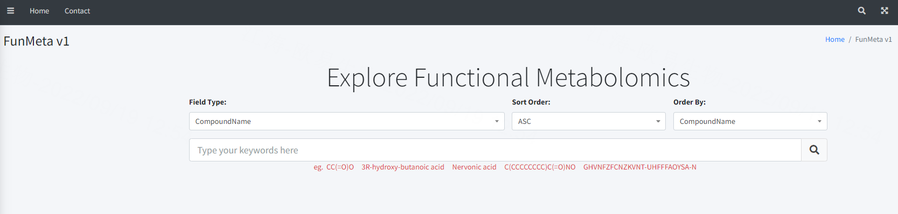

# Getting Started

### Reference Documentation
A website for exploring functional metabolomics, you can visit it on http://192.168.10.200:9999/.

### How To Use

#### 1.Searching metabolites of your interest

In the homepage,you can search for compounds by `compound name`, `molecular formula`, `SMILES`, `InChI` and `InChIKey`,
where the compound name uses the fuzzy matching principle.In addition, you can specify the sorting method and the field
used for sorting through the "Sort Order:" and "Order By:" buttons, respectively.

#### 2.View details of your query compound

Here, a `SMILES` string `CC(=O)O` which represent the structure identifier of the compound `Acetic acid` is used for query, and the exact 
matching results is generated below  the search box. Click the blue title 'Acetic acid' in the result to enter the details page.

The details page of a compound consists of two sections: 
* The left section is the basic metadata of the compound, including
  * Names and Identifier
  * Structures and Properties
  * Chemical Classification
  * Descriptions

* The right section is the metabolite-related functional network diagram,  
the graph can be zoomed in and out with strong interactivity.And users can click on the sub-nodes of interest to see more, 
these sub-nodes include:
  * pathway
  * disease
  * ontology
  * location
  * associated OMIM-IDs
  * reference

#### 3.Details page of child nodes in funmeta Network

##### 3.1 Pathway

The metabolic pathway details for metabolites consists of two parts: 
metabolic pathway network and metabolite table.

In the metabolic pathway network diagram, red dots represent metabolites, blue dots represent 
metabolic pathways directly related to metabolites, and yellow dots represent metabolic pathways 
related to blue dots. In addition, each node is clickable, and a click takes you to a new detail page.

For example, the details page for the KEGG pathway consist of four sections,each with a hyperlink to [KEGG](https://www.genome.jp/kegg):
* Pathway Information
* Pathway Related Modules
* Pathway Related Pathways
* Pathway Related Drugs
* Pathway Related References

##### 3.2 Disease

##### 3.3 Ontology

##### 3.4 Location

##### 3.5 Associated OMIM

##### 3.6 Reference

### Reference

For further reference, please consider the following sections:

* [Official Apache Maven documentation](https://maven.apache.org/guides/index.html)
* [Spring Boot Maven Plugin Reference Guide](https://docs.spring.io/spring-boot/docs/2.6.11/maven-plugin/reference/html/)
* [Create an OCI image](https://docs.spring.io/spring-boot/docs/2.6.11/maven-plugin/reference/html/#build-image)
* [MyBatis Framework](https://mybatis.org/spring-boot-starter/mybatis-spring-boot-autoconfigure/)
* [Spring Configuration Processor](https://docs.spring.io/spring-boot/docs/2.6.11/reference/htmlsingle/#appendix.configuration-metadata.annotation-processor)
* [Thymeleaf](https://docs.spring.io/spring-boot/docs/2.6.11/reference/htmlsingle/#web.servlet.spring-mvc.template-engines)
* [Spring Boot DevTools](https://docs.spring.io/spring-boot/docs/2.6.11/reference/htmlsingle/#using.devtools)
* [Spring Web](https://docs.spring.io/spring-boot/docs/2.6.11/reference/htmlsingle/#web)

### Guides for developers

The following guides illustrate how to use some features concretely:

* [MyBatis Quick Start](https://github.com/mybatis/spring-boot-starter/wiki/Quick-Start)
* [Handling Form Submission](https://spring.io/guides/gs/handling-form-submission/)
* [Accessing data with MySQL](https://spring.io/guides/gs/accessing-data-mysql/)
* [Building a RESTful Web Service](https://spring.io/guides/gs/rest-service/)
* [Serving Web Content with Spring MVC](https://spring.io/guides/gs/serving-web-content/)
* [Building REST services with Spring](https://spring.io/guides/tutorials/rest/)
